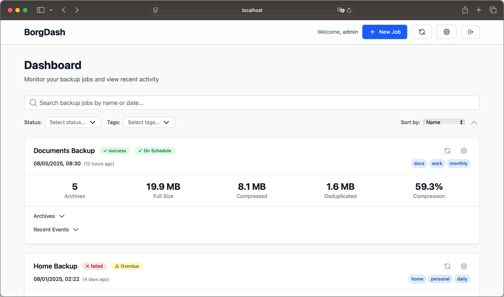

# BorgDash

 

> ⚠️ **EARLY ALPHA**: This project is in an early  stage and  heavily leveraged AI in the initial project implementation. It is in need of human validation of all components, further refinement and testing.

## Overview

BorgDash provides a simple, central overview of all your Borg backups—without needing your repo key or sensitive data.

## Features

- Push updates to BorgDash
- No repository credentials required
- No sensitive data stored in BorgDash
- Works with borg and borgmatic
- Per-Repository authentication for info push
- User authentication for Dashboard Access
- API for integration in third party tools like monitoring-tools

## Documentation

- **[Full Documentation](docs/index.md)** - Complete setup and usage guide  
- **[Quick Start Guide](docs/quickstart.md)** - Get running in minutes  
- **[Configuration](docs/configuration.md)** - Customize your setup  
- **[API Reference](docs/api.md)** - Integration details  

