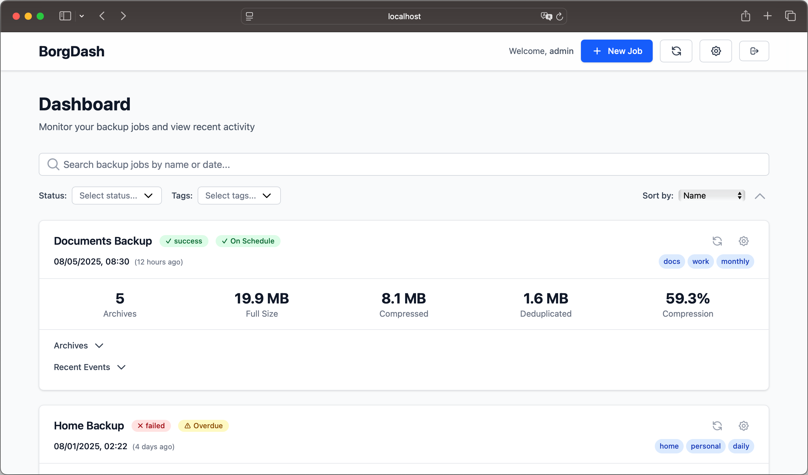

# BorgDash

BorgDash provides a simple, central overview of all your Borg backups — without knowing repo credentials or stored data.

## Features

- Push updates to BorgDash
- No repository credentials required
- No sensitive data stored in BorgDash
- Works with borg and borgmatic
- Per-Repository authentication for info push
- User authentication for Dashboard Access
- API for integration in third party tools like monitoring-tools

## How it works

- Borgmatic recieves `borg info`, `borg list`, `borgmatic info` and or `borgmatic rinfo` and some general information about a repository, from a client using `borg` or `borgmatic`, through its API
- It stores the recieved information in .json files
- The information is aggregated and displayed in the web-ui

**Security**:

- No repository credentials or actual data ever reach BorgDash
- Every client information push is authenticated by an api-key
- User access to the dashboard is authenticated by username:password
